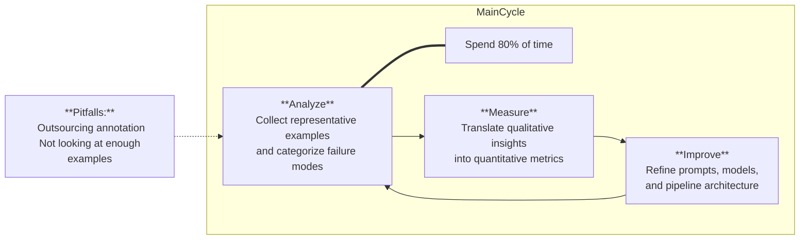

# Lesson 1: Fundamentals & Lifecycle of Application-Centric Evals

### Chapter 2: What is LLM Evaluation?
### Chapter 3: Why is LLM Development So Hard?
### Chapter 4: The Evaluation Lifecycle

  
View Chapter 4 Content

### Chapter 5: Prompting Fundamentals

  
View Chapter 5 Content

  
    Specifications: define what the bot always must do and must never do. Add your personal taste there. 

    Components of a good prompt:
    1. Role and objective "You are ___, you do ___"
    2. Instruction and rules: answer order, do's and don'ts
    3. Context: Relevant background info. Bot can't read your mind
    4. Examples or few shot prompting. Implicit Q&A
    5. Output formating: JSON, yaml, md lists

    Experiment a lot, iterate. 

    If you are not domain expert, understand your user very well, put on product hat. 

### Chapter 6: Preview of Error Analysis

  
View Chapter 6 Content

  
  Error analysis is going to be your superpower, it is not really taught anywhere else. It is not inventing something new, but it is very powerful technique. Keep this in mind. Read the coursereader chapters 1-3. 

------------------------------
[Back to Contents](./README.md)